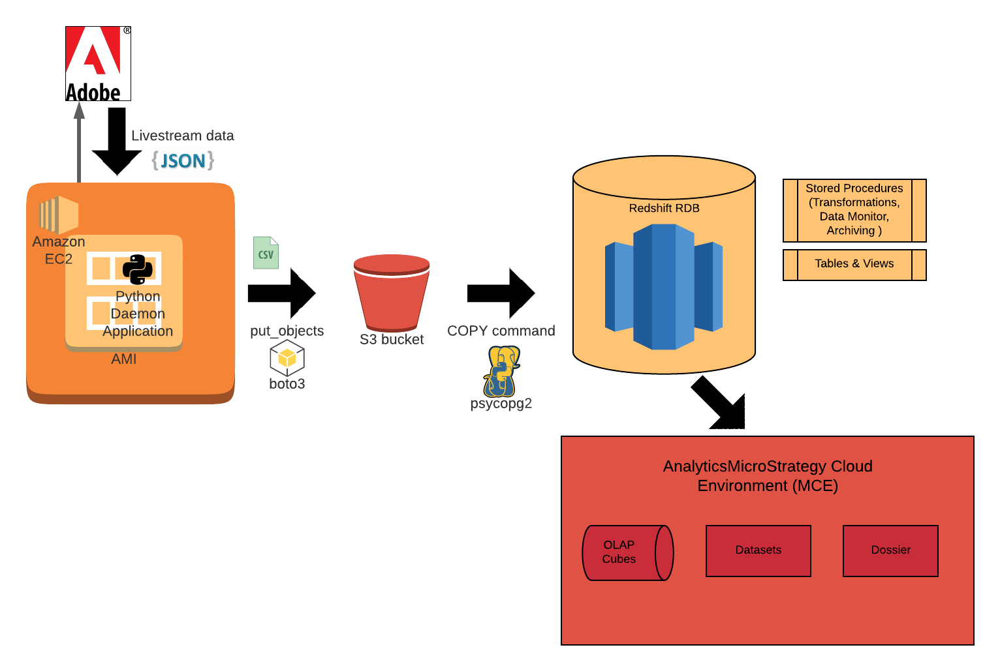
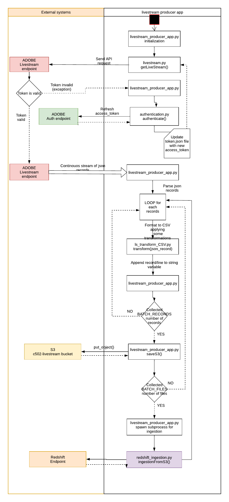

# adobe-livestream-redshift-daemon



## Introduction
**adobe-livestream-redshift-daemon** is a python client application, wrapped in a Linux Daemon, that acts as producer for Adobe Livestream data. 

The application starts a stream request to Adobe Livestream endpoint; each record received is validated, parsed and transformed.
When a specific number of records are grouped (BATCH_SIZE set as 1000), they are uploaded to an S3 bucket as a single CSV file; when a certain number of files are collected in a directory on S3 (BATCH_FILES set as 10), a copy command is triggered to ingest in parallel the records from the files in S3 to the Redshift database.

It is based on the ***daemon.py*** script and the init script is structured so that it is possible to run multiple parallel and indipendent instances of it.

## Content 
All content of the application is in the root folder **/adobe-livestream-redshift-daemon**; the only file in other directory is the pid file, containing the process pid of the producer instance running, which is located in the /tmp/ folder (fullpath of file is __/tmp/livestream_producer_app-1.pid__).

The root directory contains all the python scripts. The _data_ subfolder contains files necessary for the authentication or initialization:
- **config_admin.json** containing the service account information for the authentication;
- **pkey.key** private key necessary for encoding the jwt;
- **token.json** containing the current access_token for Livestream request;
- **producer_parameters.json** containing the values for core variables for determining the behaviour of the application and used the application initialization:

    - maxConnections, reset, smoothing and smoothingBucketSize parameters for setting up the livestream request;
    - BATCH_RECORDS and BATCH_FILES that determine the number of records to include in a single file and the number of files to load in parallel with the COPY command;
    - Redshift parameters to connect to the RDS database and load data into the staging table;
    - S3 parameters to connect to the bucket where CSV files are loaded and taken for ingestion.

The _data/logs_ subfolder contains the logs for the producer process:
- **daemonlog_i** containing the execution logs of the daemon with ID i;
- **stderr.log** containing the stderr.

Regarding the daemonlog_1, the logger implemented is _TimedRotating_: at 00:00 UTC the current log file is renamed to include the date timestamp, and a new log file is generated and used.

## Additional external libraries
- **boto3**: implements the function to enable communication between the producer and S3;

- **psycopg2**: module for establishing a connection to the Redshift database in order to run the copy command.


# Scripts details



## livestream-producer-app.py

Contains the core of the application: the class livestream_producer_app inherits from the daemon.py class, overriding the two core methods for implementing the client application. The init method initialize the daemon's logs file (stderr.log and daemonlog_ID file, in the subdirectory /data/logs) and pid file (the file containing the process id of the running instance on the EC2 Linux machine).

### Variables
- **ID** is the id assigned to the producer instance. Currently, a single instance of the application is run on the EC2 machine, therefore the ID used to run is 1;
- **BATCH_RECORDS** is the number of records collected and saved in a single CSV file to upload to S3;
- **BATCH_FILES** is the number of files saved in a common S3 folder and ingested in parallel with the copy command.

### Init method

The stderr is redirected to the stderr.log file.
The main log file implements the TimedRotatingFileHandler strategy: at midnight UTC the current log file is renamed by appending the date string to its name, and a new log file is generated and used for the logging.

### Run method
The run method defines the core of the application: steps implementd are:
1. Start data stream and loop on records received      
2. Parse, filter and transform the JSON record     
3. Upload to S3 

The saveS3 method call the boto3 method put_object to upload to the S3 bucket the records collected. The object body is a string containing BATCH_RECORDS number of records, each formatted as single CSV row. 
The key is the S3 path of the file, for example: 
```bash
ToIngest/20201005/000ee634-cdd9-4e39-8efc-3127f7c41e08/1.csv
```
The base folder is the ToIngest folder on the S3 bucket; the first level subfolder is the current date timestamp, the second level subfolder is a unique id associated with the batch of files for which the copy command will run in parallel; the single filename is a number between 0-9.

4. Ingestion to Redshift with copy command

When a number of files equal to BATCH_FILES constant have been uploaded on S3 in a folder, a subprocess is created to run the copy command. Details about the redshift_ingestion.py script are provided later.

## livestream.py
Module that implements the function to set and start the Livestream dataflow. In order to authenticate the request, the access token retrieved by the authentication module and stored in token.json file needs to be included in the header request.

In addition, a series of parameters can be provided following the livestream API documentation:
- **maxConnections**: indicates how many clients will connect to the same stream.	An integer between 1 and 8;
- **reset**: indicates age of data to return during initial connection/reconnection. smallest will stream the oldest possible data. largest will stream the newest possible data;
- **smoothing** [OPTIONAL]: smooths the rate of records returned by Livestream by using a server-side buffer. 1 to enable smoothing. Remove the parameter to disable it;
- **smoothingBucketSize** [OPTIONAL]: the size of the time window to use to determine the average traffic rate that is used in smoothing data returned by Livestream. An integer between 1 and 7200. The default is 270 seconds.

These parameters are hard-coded in the livestream_producer_app.py script.


## authentication.py
Script that takes care of the authentication for the Livestream request. The token produced has a validity of 24 hours.
The *authenticate()* function first extract the data for the request from the *config_admin.json* file  with the *importConfigFile* function (json previously generated in the Adobe platform and connected to the service account) to format the jwt payload for the API POST request, then requests the new access token calling the *retrieveToken()* function.
The new access token is saved in data/token.json file, and it will be read by the *livestream.py* module to send the API GET request to start the data stream.


## ls_tranform_CSV.py
When a json record is received, it is passed to the *ls_transform_CSV.py* script for:

1. Removing empty fiels and not needed variables to reduce the size of the data sent from the EC2 to S3 and from S3 to Redshift;

2. Format the record as CSV row string, to makes the copy command easier for ingesting data into Redshift. To achieve this, the single fields are extracted from the json record and appended with the delimiter defined;

3. Check and format properly date, numeric and other fields to meet Redshift data type requirements; to achieve this, a series of function are implemented.


## redshift_ingestion.py
Python module to execute the copy command for ingesting data from S3 to Redshift. It is run by the livestream_producer_app.py script as an indipendent and asyncronous script, with the key parameter as input argument.

Once created a redshift connection to the specific host with the psycopg2 module, the copy command is executed.

In the COPY command the following needs to be specified:
- Target table and table columns to be populated: defined as the adobe_ls.adobe_livestream_stg staging table;
- S3 CSV file location: defined with the bucketname and key parameter, with the second input argument of the script;
- Region;
- IAM role for S3 authentication;
- delimiter: char used to delimit the CSV columns, defined as ~;
- Options: EMPTYASNULL to force null value when no actual value is present in the CSV (as Redshift would consider valid empty string as value for VARCHAR fields).


